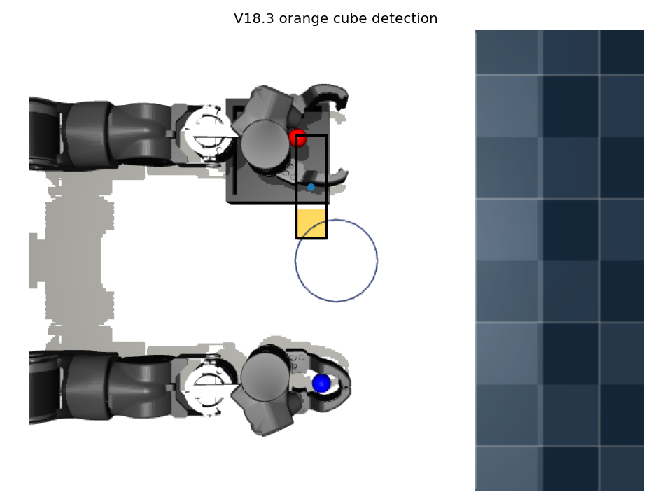
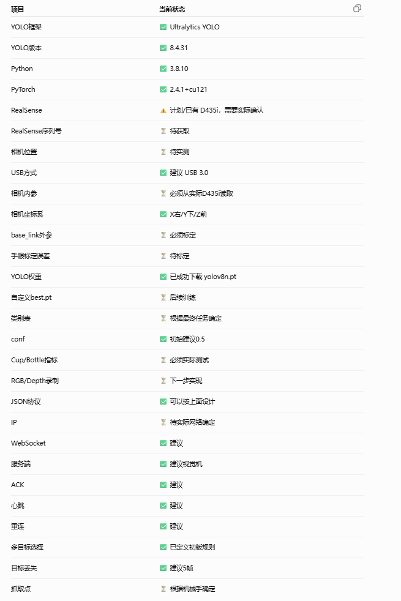
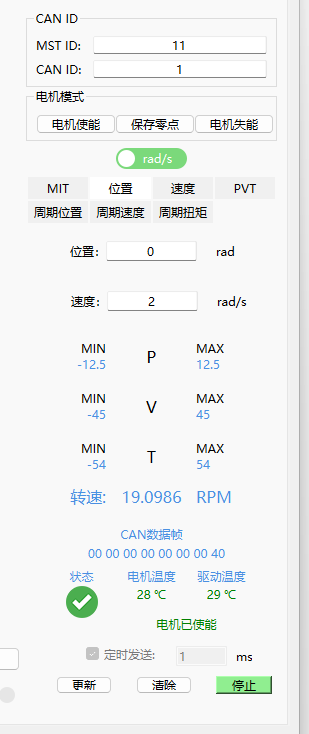

# OpenArm_上位机课程项目汇报

- Source: `OpenArm_上位机课程项目汇报.pptx`
- Total slides: 10

## Slide 1

COURSE PROJECT / 课程项目阶段汇报

- OpenArm
- 视觉—上位机联调

- 仿真软件闭环已完成
- 真机控制保持安全闭锁

上位机工作内容 · 仿真演示 · 真机侧演示 · 部署阻塞分析

### Speaker Notes

- 开场先给出阶段结论：本次负责的是上位机集成。仿真侧可以形成视觉—上位机—任务执行闭环；真机侧没有为了赶进度而绕过安全条件。
- [Sources]
- - media/v2.png
- - upper_computer/README.md

## Slide 2

OPENARM / UPPER COMPUTER

我的工作：把视觉、仿真与电控统一到一个上位机入口

01

02

03

界面与任务流程

三类接口适配

安全与可验证性

- 目标画面与检测框
- 任务确认 / 回零 / 取消
- 状态机与会话日志

- 离线回放
- MuJoCo WebSocket
- RealSense / YOLO WebSocket
- USART10 协议工具

- 坐标系与工作空间校验
- 超时、重连、队列限流
- 急停锁存与执行闭锁
- 自动测试和联调文档

核心原则：UI 不直接绑定某一个视觉程序或电机协议；通过传输层切换数据源，通过安全层决定是否允许执行。

02

### Speaker Notes

- 这一页说明上位机工作不是单一界面，而是把视觉、电控、仿真和安全状态整合为可替换的模块。
- [Sources]
- - upper_computer/PROJECT_STRUCTURE_ZH.md
- - upper_computer/src/openarm_upper/

## Slide 3

OPENARM / UPPER COMPUTER

当前上位机交付规模已经覆盖开发、测试与联调资料

统计不含 vendor 原始资料、运行日志、.venv 与缓存；用于展示当前交付模块规模，不把同学提供的代码计入个人新增代码。

18 / 1,754

28

3 + 6 + 5

应用源码文件 / 行

自动测试

模式 / 配置 / 启动入口

GUI、消息模型、安全、状态机、日志、传输与协议

9 个测试文件，覆盖消息、WebSocket、安全和 USART10

回放、MuJoCo、真机视觉；统一课程演示菜单已整理

另有：3 个只读工具、5 份联调文档、2 个仿真视觉文件（1,009 行）

03

### Speaker Notes

- 工作量用可复算的文件和行数表达。这里强调是当前上位机交付范围，不把 vendor 中电控或视觉同学的原始代码当作个人工作量。
- [Sources]
- - upper_computer/report/build/source-notes.txt
- - upper_computer/tests/

## Slide 4

OPENARM / UPPER COMPUTER

同一套 UI，通过传输适配器切换三种联调模式

上位机不把“看见目标”直接等同于“允许运动”

执行权限由坐标、时效、工作空间、接口完备度和运行模式共同决定。

数据源

传输适配

上位机核心

执行边界

- 回放 JSONL
- MuJoCo RGB
- RealSense / YOLO

- DetectionBatch
- TaskStatus
- 有界队列 / 重连

- 画面与目标
- 安全校验
- 任务状态机 / 日志

- MuJoCo：允许仿真执行
- 真机视觉：只观察
- USART10：只读

04

### Speaker Notes

- 重点讲右侧的执行边界：相同界面并不意味着相同权限。仿真模式能够执行，真机模式在证据不完整时必须被锁住。
- [Sources]
- - upper_computer/src/openarm_upper/transports/
- - upper_computer/src/openarm_upper/safety.py
- - upper_computer/config/

## Slide 5

LIVE DEMO / MUJOCO FIRST

演示一：仿真上位机展示完整的视觉—任务闭环

启动顺序

- ① 运行 MuJoCo 视觉桥
- ② 运行仿真上位机
- ③ 识别橙色方块
- ④ 确认执行抓取放置

•

640×480 虚拟相机，5 FPS 持续中间帧

•

检测框、置信度与 base_link 坐标

•

PLANNING / EXECUTING / SUCCEEDED 状态回传

画面来自 MuJoCo RGB 渲染，不用物体 body 坐标冒充视觉结果

05

### Speaker Notes

- 现场先运行 run_mujoco_vision_bridge.bat，再运行 run_mujoco_upper_computer.bat。点击确认后不要只看 Viewer，也要指出上位机相机画面在运动过程中持续更新。
- [Sources]
- - outputs/bimanual_task_planner_demo/vision_debug_v18/vision_right_001_detection.png
- - upper_computer/docs/MUJOCO_UPPER_INTEGRATION_ZH.md

## Slide 6

OPENARM / UPPER COMPUTER

仿真闭环不是静态截图，而是可重复验证的执行过程

2 / 2

51 帧 / 6.06 s

原 V18.3 左右视觉放置成功

运动区间 JPEG 全部不同

视觉确认

安全与规划

执行与证据

RGB → 检测

目标 → 任务

动作 → 结果

橙色分割、检测框、像素反投影与目标时效校验

工作空间检查、稳定示教点匹配、双臂规划器与碰撞日志

抓取、抬升、放置、状态回传、会话与任务日志

当前桥接仍只开放已验证右臂固定点；任意目标和中途急停属于下一阶段。

06

### Speaker Notes

- 2/2 是原 V18.3 报告结果；51 帧是本次实时推流回归。说明复用了已有可靠动作，同时新增了上位机链路和运动中间帧，而不是重新发明控制器。
- [Sources]
- - outputs/bimanual_task_planner_demo/vision_grasp_report_v18.md
- - upper_computer/docs/MUJOCO_UPPER_INTEGRATION_ZH.md

## Slide 7

REAL-SIDE UPPER COMPUTER / SECOND DEMO

真机侧已完成“可观察、可诊断、不可误执行”

视觉接入

•

兼容视觉组 robot_state WebSocket

•

实时 JPEG、类别、像素中心与深度

•

心跳、断线重连、超时和队列限流

电控接入

•

USART10 24 字节编解码与流解析

•

J1～J7 CAN ID、路由和限位配置

•

串口枚举与 J1 只读监视工具

真机运动写入仍被明确禁用

07

### Speaker Notes

- 这里展示的是‘真机侧上位机能力’，不是声称已经完成真机抓取。先展示视觉监视，再展示电控协议和端口诊断，最后指出写控制被安全锁住。
- [Sources]
- - upper_computer/report/assets/vision_team_status.png
- - upper_computer/vendor/electrical_reference/motor_j1_can_tool.png
- - upper_computer/docs/VISION_INTEGRATION_REVIEW_ZH.md
- - upper_computer/docs/ELECTRICAL_INTEGRATION_REVIEW_ZH.md

## Slide 8

OPENARM / UPPER COMPUTER

演示二：真机上位机按“观察 → 诊断 → 只读”展开

01

02

03

04

连接视觉服务

展示实时感知

扫描串口

展示协议工具

- 运行 run_vision_monitor.bat
- 接收 D435i / YOLO WebSocket

- JPEG、类别、像素 x/y
- 以及深度 z 与失联提示

- 运行 scan_serial_ports.bat
- 证明当前无 USB-UART 候选

- 离线编码 / 解码 / 捕获解析
- 真机仅允许 J1 只读监视

执行按钮保持锁定：当前演示验证的是上位机接口与安全行为，不是假装已经具备真机闭环。

08

### Speaker Notes

- 如果现场没有 D435i 或视觉机，用已有消息和只观察界面展示接口；不要为了演示效果连接未知 COM 口。串口扫描是演示的一部分，它证明系统没有猜端口。
- [Sources]
- - upper_computer/report/演示与汇报说明.md
- - upper_computer/run_course_demo.bat
- - upper_computer/tools/list_serial_ports.py

## Slide 9

OPENARM / UPPER COMPUTER

真机未完成部署：控制闭环与安全依据仍缺失

所有阻塞项都来自现有资料和现场检查；在它们闭环前开放写控制会把软件问题变成人身与设备风险。

阻塞项

当前证据

缺失闭环

风险

视觉标定

x/y 是像素，z 是深度

内参、手眼外参、base_link 三维点

抓错位置

固件闭环

仅回传 J1；pc_data 未驱动电机

7 关节命令/遥测、ACK、看门狗

失控或不可验证

关节映射

CAN ID、路由和方向端点已知

机械零位、符号、偏置与低速实测

越限 / 碰撞

硬件安全

3.3V TTL、115200 已确认

USB-UART、物理急停、断电回路

人员与设备风险

工程判断：保持只读与执行闭锁，是当前资料条件下正确的完成状态。

09

### Speaker Notes

- 不要用‘还没来得及’解释真机未完成。应说明：视觉标定、固件七关节闭环、零位映射、硬急停和适配器都不完整；上位机已经识别这些缺口并阻止误执行。
- [Sources]
- - upper_computer/docs/ELECTRICAL_INTEGRATION_REVIEW_ZH.md
- - upper_computer/docs/VISION_INTEGRATION_REVIEW_ZH.md
- - upper_computer/docs/TEAMMATE_INTERFACE_CHECKLIST_ZH.md

## Slide 10

OPENARM / UPPER COMPUTER

阶段结论：仿真闭环可验收，真机必须补齐接口后再开放

已交付

真机开放前的四道门槛

01

•

统一上位机 GUI、消息、安全和状态机

完成 D435i 内参与手眼标定

•

MuJoCo 实时视觉与任务执行闭环

02

升级固件为 7 关节命令/遥测闭环

•

真机视觉监视、USART10 工具与资料审查

03

低速确认零位、方向、偏置与限位

•

28 项测试、运行日志和演示手册

04

验证物理急停、看门狗、ACK 与故障恢复

下一阶段路线：标定 → 固件闭环 → 单关节低速 → 七关节联调 → 视觉抓取

10

### Speaker Notes

- 收尾回到课程目标：上位机软件工作已经形成可演示、可测试、可继续接真的基础。下一步不是重写界面，而是让视觉与电控按清单补齐可执行证据。
- [Sources]
- - upper_computer/report/演示与汇报说明.md
- - upper_computer/PROJECT_STRUCTURE_ZH.md
- - upper_computer/docs/TEAMMATE_INTERFACE_CHECKLIST_ZH.md
