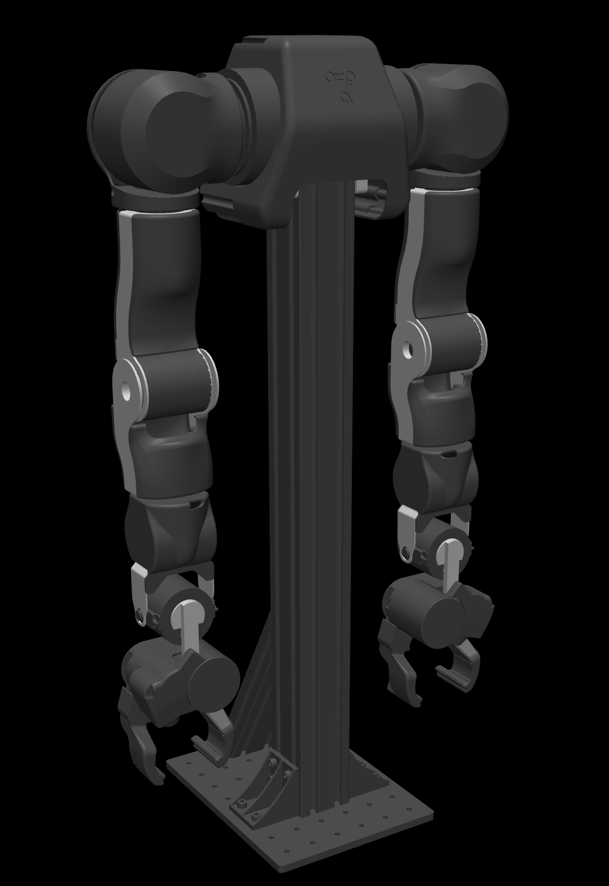

# OpenArm_上位机课程项目汇报_enhanced

- Source: `OpenArm_上位机课程项目汇报_enhanced.pptx`
- Total slides: 10

## Slide 1

COURSE PROJECT / 课程项目阶段汇报

- OpenArm
- 视觉—上位机联调

- 仿真软件闭环已完成
- 真机控制保持安全闭锁

上位机工作内容 · 仿真演示 · 真机侧演示 · 部署阻塞分析

### Speaker Notes

老师好，我今天汇报的是 OpenArm 视觉与上位机联调项目，我在课程项目中主要负责上位机的设计、实现和集成。当前阶段的结论是：仿真侧已经打通视觉、上位机和任务执行闭环；真机侧已经具备观察与诊断能力，但为了人员和设备安全，运动控制仍然保持闭锁。

## Slide 2

OPENARM / UPPER COMPUTER

我的工作：把视觉、仿真与电控统一到一个上位机入口

01

02

03

界面与任务流程

三类接口适配

安全与可验证性

- 目标画面与检测框
- 任务确认 / 回零 / 取消
- 状态机与会话日志

- 离线回放
- MuJoCo WebSocket
- RealSense / YOLO WebSocket
- USART10 协议工具

- 坐标系与工作空间校验
- 超时、重连、队列限流
- 急停锁存与执行闭锁
- 自动测试和联调文档

核心原则：UI 不直接绑定某一个视觉程序或电机协议；通过传输层切换数据源，通过安全层决定是否允许执行。

02

### Speaker Notes

我的工作不只是做一个显示窗口，而是给视觉、仿真和电控提供同一个上位机入口。界面层负责显示相机画面、检测框、任务状态和日志；适配层让离线回放、MuJoCo 和真机视觉可以替换接入；安全层再根据坐标有效性、目标时效、工作空间和运行模式判断是否允许执行。这样做的好处是，后续视觉或电控接口变化时，不需要把整套上位机推倒重写。

## Slide 3

OPENARM / UPPER COMPUTER

当前上位机交付规模已经覆盖开发、测试与联调资料

统计不含 vendor 原始资料、运行日志、.venv 与缓存；用于展示当前交付模块规模，不把同学提供的代码计入个人新增代码。

18 / 1,754

28

3 + 6 + 5

应用源码文件 / 行

自动测试

模式 / 配置 / 启动入口

GUI、消息模型、安全、状态机、日志、传输与协议

9 个测试文件，覆盖消息、WebSocket、安全和 USART10

回放、MuJoCo、真机视觉；统一课程演示菜单已整理

另有：3 个只读工具、5 份联调文档、2 个仿真视觉文件（1,009 行）

03

### Speaker Notes

这一页用可复算的数据说明我的工作量。当前上位机应用部分共有 18 个源码文件、1754 行代码，另有 28 项自动测试，以及三种运行模式、六份配置和五个启动入口；此外还整理了只读诊断工具、联调文档和仿真视觉桥。这里的统计排除了 vendor 原始资料、虚拟环境、缓存和运行日志，也没有把视觉组、电控组交给我的原始代码算成个人新增工作量，所以这个口径比较保守，也便于老师复查。

## Slide 4

OPENARM / UPPER COMPUTER

同一套 UI，通过传输适配器切换三种联调模式

上位机不把“看见目标”直接等同于“允许运动”

执行权限由坐标、时效、工作空间、接口完备度和运行模式共同决定。

数据源

传输适配

上位机核心

执行边界

- 回放 JSONL
- MuJoCo RGB
- RealSense / YOLO

- DetectionBatch
- TaskStatus
- 有界队列 / 重连

- 画面与目标
- 安全校验
- 任务状态机 / 日志

- MuJoCo：允许仿真执行
- 真机视觉：只观察
- USART10：只读

04

### Speaker Notes

系统结构可以从左向右理解：数据先来自回放文件、MuJoCo 相机或 RealSense 与 YOLO，再被转换成统一的检测消息和任务状态，最后进入上位机的显示、安全校验、状态机和日志模块。三种模式共用一套界面和核心逻辑，但执行权限不同：MuJoCo 可以执行已经验证的动作，真机视觉目前只观察，USART10 目前只读。这里最重要的原则是，看见目标不等于允许机械臂运动，必须先满足坐标、时效、工作空间和接口完备度等条件。

## Slide 5

LIVE DEMO / MUJOCO FIRST

演示一：仿真上位机展示完整的视觉—任务闭环

启动顺序

- ① 运行 MuJoCo 视觉桥
- ② 运行仿真上位机
- ③ 识别橙色方块
- ④ 确认执行抓取放置

•

640×480 虚拟相机，5 FPS 持续中间帧

•

检测框、置信度与 base_link 坐标

•

PLANNING / EXECUTING / SUCCEEDED 状态回传

画面来自 MuJoCo RGB 渲染，不用物体 body 坐标冒充视觉结果

05

### Speaker Notes

下面先演示仿真上位机。启动时先运行 MuJoCo 视觉桥，再运行仿真上位机；虚拟相机持续输出 640 乘 480 的 RGB 画面，上位机会显示橙色方块的检测框、置信度和换算后的 base_link 坐标。确认任务后，界面会依次回传 PLANNING、EXECUTING 和 SUCCEEDED 状态，而且机械臂运动期间相机中间帧持续刷新。这里的目标位置来自 MuJoCo 的 RGB 渲染和视觉反投影，没有直接读取物体 body 坐标来假装视觉识别。

## Slide 6

OPENARM / UPPER COMPUTER

仿真闭环不是静态截图，而是可重复验证的执行过程

2 / 2

51 帧 / 6.06 s

原 V18.3 左右视觉放置成功

运动区间 JPEG 全部不同

视觉确认

安全与规划

执行与证据

RGB → 检测

目标 → 任务

动作 → 结果

橙色分割、检测框、像素反投影与目标时效校验

工作空间检查、稳定示教点匹配、双臂规划器与碰撞日志

抓取、抬升、放置、状态回传、会话与任务日志

当前桥接仍只开放已验证右臂固定点；任意目标和中途急停属于下一阶段。

06

### Speaker Notes

仿真结果不是最开始和最后两张静态截图，而是可以重复运行和检查的过程。原有 V18.3 双臂任务中，左右视觉放置结果是二比二成功；本次上位机实时推流回归又记录了 6.06 秒内 51 张互不相同的运动区间 JPEG，证明执行过程中画面确实连续变化。完整链路包括 RGB 检测、像素反投影、目标时效与工作空间校验、任务规划、抓取放置、状态回传和日志留存。当前只开放经过验证的右臂固定示教点，任意目标抓取和动作中途立即急停仍属于下一阶段，不在这里夸大完成度。

## Slide 7

REAL-SIDE UPPER COMPUTER / SECOND DEMO

真机侧已完成“可观察、可诊断、不可误执行”

视觉接入

•

兼容视觉组 robot_state WebSocket

•

实时 JPEG、类别、像素中心与深度

•

心跳、断线重连、超时和队列限流

电控接入

•

USART10 24 字节编解码与流解析

•

J1～J7 CAN ID、路由和限位配置

•

串口枚举与 J1 只读监视工具

真机运动写入仍被明确禁用

07

### Speaker Notes

接下来是真机侧上位机能力。视觉接口已经兼容视觉组的 robot_state WebSocket，可以接收实时 JPEG、类别、像素中心和深度，并处理心跳、超时、断线重连和消息队列限流。电控侧已经根据同学提供的资料实现 USART10 的 24 字节编解码与流解析，录入 J1 到 J7 的 CAN ID、总线路由和限位，还提供串口枚举与 J1 只读监视工具。这里展示的是可观察、可诊断、不可误执行，不能把它表述成已经完成真机抓取。

## Slide 8

OPENARM / UPPER COMPUTER

演示二：真机上位机按“观察 → 诊断 → 只读”展开

01

02

03

04

连接视觉服务

展示实时感知

扫描串口

展示协议工具

- 运行 run_vision_monitor.bat
- 接收 D435i / YOLO WebSocket

- JPEG、类别、像素 x/y
- 以及深度 z 与失联提示

- 运行 scan_serial_ports.bat
- 证明当前无 USB-UART 候选

- 离线编码 / 解码 / 捕获解析
- 真机仅允许 J1 只读监视

执行按钮保持锁定：当前演示验证的是上位机接口与安全行为，不是假装已经具备真机闭环。

08

### Speaker Notes

真机演示按观察、诊断、只读三个层次展开。首先连接视觉服务，展示相机画面、检测类别、像素坐标、深度以及失联提示；然后扫描本机串口，明确显示当前是否存在 USB 转串口设备，而不是猜测一个 COM 口；最后用协议工具展示离线编码、解码、报文捕获解析和 J1 只读监视。即使现场暂时没有 D435i 或 USB 转串口，这些离线与只读功能仍能验证上位机接口和安全行为，但执行按钮会继续锁定。

## Slide 9

OPENARM / UPPER COMPUTER

真机未完成部署：控制闭环与安全依据仍缺失

所有阻塞项都来自现有资料和现场检查；在它们闭环前开放写控制会把软件问题变成人身与设备风险。

阻塞项

当前证据

缺失闭环

风险

视觉标定

x/y 是像素，z 是深度

内参、手眼外参、base_link 三维点

抓错位置

固件闭环

仅回传 J1；pc_data 未驱动电机

7 关节命令/遥测、ACK、看门狗

失控或不可验证

关节映射

CAN ID、路由和方向端点已知

机械零位、符号、偏置与低速实测

越限 / 碰撞

硬件安全

3.3V TTL、115200 已确认

USB-UART、物理急停、断电回路

人员与设备风险

工程判断：保持只读与执行闭锁，是当前资料条件下正确的完成状态。

09

### Speaker Notes

这一页从左到右说明真机没有最终部署的四类原因。视觉侧目前只有像素 x、y 和深度 z，还缺相机内参、手眼外参以及转换到 base_link 的三维坐标；固件侧目前证据只覆盖 J1 回传，而且 pc_data 没有真正驱动电机，还缺七关节命令与遥测、ACK 和看门狗闭环；机械侧虽然已知 CAN ID、总线路由和方向端点，但机械零位、符号和偏置还没有低速实测；硬件侧也缺 USB 转串口、物理急停和可靠断电回路。因此这不是简单的“来不及做完”，而是控制闭环与安全依据不足，在这些条件补齐前保持只读和执行闭锁才是正确的工程状态。

## Slide 10

OPENARM / UPPER COMPUTER

阶段结论：仿真闭环可验收，真机必须补齐接口后再开放

已交付

真机开放前的四道门槛

01

•

统一上位机 GUI、消息、安全和状态机

完成 D435i 内参与手眼标定

•

MuJoCo 实时视觉与任务执行闭环

02

升级固件为 7 关节命令/遥测闭环

•

真机视觉监视、USART10 工具与资料审查

03

低速确认零位、方向、偏置与限位

•

28 项测试、运行日志和演示手册

04

验证物理急停、看门狗、ACK 与故障恢复

下一阶段路线：标定 → 固件闭环 → 单关节低速 → 七关节联调 → 视觉抓取

10

### Speaker Notes

最后总结一下：我已经交付统一上位机界面、消息模型、安全与状态机，完成 MuJoCo 实时视觉和任务执行闭环，并准备了真机视觉监视、USART10 工具、28 项测试、日志和演示文档。真机开放前还需要完成 D435i 与手眼标定、七关节固件闭环、低速零位与限位验证，以及物理急停、看门狗、ACK 和故障恢复验证。下一阶段可以沿着标定、固件闭环、单关节低速、七关节联调、视觉抓取的顺序推进，而不需要重新设计上位机框架。我的汇报到这里，谢谢老师。
